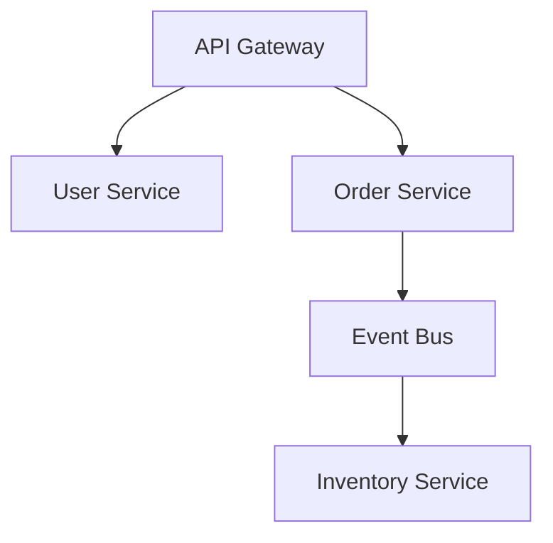

# Architecture Generative AI — MVP実装計画（改訂版）

> 作成日: 2026-03-15
> 改訂理由: コード生成はDesign_BrainModel Core（既実装）で行う前提に変更

---

## 1. 前提の整理

### 1.1 コアの原則

**Architecture Generative AI は Design_BrainModel Core のフロントエンドである。**

コード生成・アーキテクチャ生成に必要な機能はすでに実装済みである：

| 機能 | 既実装クレート |
|-----|-------------|
| Architecture → CodeIR変換 | `code_ir` — `DeterministicArchitectureToCodeIR` |
| CodeIR → Rustコード生成 | `code_ir` — `DeterministicCodeGenerator` |
| アーキテクチャ候補探索 | `design_search_engine` — `BeamSearchController` |
| 多目的評価・Pareto最適化 | `agent_core` — `ParetoFront`, Phase1Engine |
| ワールドモデル推論 | `runtime_vm` — Phase9パイプライン |
| 仮説生成 | `design_reasoning` — `SimpleHypothesisGenerator` |
| 設計状態管理 | `agent_core` — `AppState`, `InteractionLayer` |
| コード↔アーキテクチャ逆変換 | `architecture_reasoner` — `ReverseArchitectureReasoner` |

**MVPで新規実装するのは以下のみ：**
1. `arch-gen` CLIバイナリ（CoreのCLIフロントエンド）
2. 出力フォーマッタ（Mermaid / Markdown / PlantUML）
3. 入力ブリッジ（自然言語 → 既存パイプラインへの接続）

### 1.2 既存CLIとの関係

現在の `apps/cli/design_main.rs` には `Phase9` コマンドが存在し、テキスト入力からアーキテクチャ探索まで動作する。`arch-gen` はこの上位UIとして構築する。

```
arch-gen（新規）
    └── Design_BrainModel Core（既存）
            ├── Phase9パイプライン（RuntimeHybridVm + BeamSearchController）
            ├── CodeIR生成（DeterministicArchitectureToCodeIR）
            ├── コード生成（DeterministicCodeGenerator）
            └── 評価（EvaluationVector, SimulationResult）
```

---

## 2. アーキテクチャ概要

```
┌─────────────────────────────────────────────────────────┐
│                     arch-gen CLI                         │
│   generate / evaluate / export / explain / refine        │
└─────────────────────┬───────────────────────────────────┘
                      │ 入力: 自然言語テキスト / 設計ファイル
┌─────────────────────▼───────────────────────────────────┐
│              InputBridge（新規: 薄いアダプタ）            │
│  - 自然言語テキスト → AgentInput / Phase9入力へ変換       │
│  - 設計ファイル(JSON) → AppState ロード                   │
└─────────────────────┬───────────────────────────────────┘
                      │
┌─────────────────────▼───────────────────────────────────┐
│         Design_BrainModel Core（すべて既実装）            │
│                                                          │
│  ┌─────────────────────────────────────────────────┐    │
│  │  Phase9 Pipeline                                │    │
│  │  RuntimeHybridVm → Phase9RuntimeAdapter          │    │
│  │  → SimpleHypothesisGenerator                    │    │
│  │  → DeterministicWorldModel                      │    │
│  │  → BeamSearchController                         │    │
│  │  → rank_candidates / ParetoFront                │    │
│  └──────────────────────┬──────────────────────────┘    │
│                         │ DesignState候補群               │
│  ┌──────────────────────▼──────────────────────────┐    │
│  │  CodeIR Pipeline                                │    │
│  │  Architecture → DeterministicArchitectureToCodeIR│    │
│  │  → CodeIR → DeterministicCodeGenerator          │    │
│  │  → SourceTree（Rustコード）                      │    │
│  └──────────────────────┬──────────────────────────┘    │
│                         │ CodeIR + SourceTree            │
│  ┌──────────────────────▼──────────────────────────┐    │
│  │  Evaluation                                     │    │
│  │  EvaluationVector / SimulationResult            │    │
│  │  CodeMetrics（結合度, 循環依存, 深さ）            │    │
│  └──────────────────────┬──────────────────────────┘    │
└─────────────────────────┼───────────────────────────────┘
                          │
┌─────────────────────────▼───────────────────────────────┐
│             OutputFormatter（新規）                       │
│   - JSON（機械可読）                                     │
│   - Mermaid（ダイアグラム）                              │
│   - Markdown（人間可読レポート）                         │
│   - PlantUML（UML出力）                                  │
│   - SourceTree（生成コードファイル）                      │
└─────────────────────────────────────────────────────────┘
```

---

## 3. 新規実装するコンポーネント

### 3.1 クレート・ディレクトリ構成

```
apps/
└── arch_gen/                     # 新規: MVPバイナリ
    ├── src/
    │   ├── main.rs
    │   ├── config.rs             # 設定（出力先、フォーマット等）
    │   ├── input_bridge/
    │   │   ├── mod.rs
    │   │   ├── text_parser.rs    # 自然言語 → Phase9入力への変換
    │   │   └── file_loader.rs    # JSON設計ファイルロード
    │   ├── commands/
    │   │   ├── mod.rs
    │   │   ├── generate.rs       # Phase9パイプライン呼び出し
    │   │   ├── evaluate.rs       # EvaluationVector表示
    │   │   ├── export.rs         # フォーマット出力
    │   │   ├── explain.rs        # 設計説明
    │   │   └── refine.rs         # 追加条件で再探索
    │   └── output/
    │       ├── mod.rs
    │       ├── mermaid.rs        # Mermaid記法生成
    │       ├── plantuml.rs       # PlantUML生成
    │       ├── markdown.rs       # Markdownレポート
    │       └── source_writer.rs  # SourceTree → ファイル書き出し
    └── Cargo.toml
```

**既存クレートはそのまま利用。新規クレートは追加しない。**
OutputFormatterのロジックは `apps/arch_gen/src/output/` 内に閉じ込める。

### 3.2 InputBridgeの役割

既存の `Phase9` コマンドは `String` を受け取り `RuntimeHybridVm` に渡す。
`InputBridge` は自然言語テキストをそのまま渡す薄いアダプタである。

```rust
// apps/arch_gen/src/input_bridge/text_parser.rs

pub struct GenerateRequest {
    pub raw_text: String,
    pub beam_width: usize,
    pub max_depth: usize,
    pub candidates: usize,
}

/// Phase9パイプラインへの入力に変換する（型変換のみ）
pub fn to_phase9_input(req: &GenerateRequest) -> Phase9Input {
    Phase9Input {
        text: req.raw_text.clone(),
        beam_width: req.beam_width,
        max_depth: req.max_depth,
    }
}
```

LLMは使用しない。Design_BrainModel Coreが自然言語を内部で処理する。

---

## 4. CLIインターフェース仕様

### 4.1 コマンド一覧

```
arch-gen <COMMAND>

Commands:
  generate  要件テキストからアーキテクチャを生成しコードを出力
  evaluate  設計ファイルを評価してスコアを表示
  export    設計ファイルを指定フォーマットで出力
  explain   設計の説明レポートを生成
  refine    追加条件で設計を再探索
  help      ヘルプ
```

### 4.2 `generate` コマンド

```
arch-gen generate [OPTIONS] <REQUIREMENT>

Arguments:
  <REQUIREMENT>  要件テキスト（または @ファイルパス）

Options:
  -n, --candidates <N>     出力する候補数 [default: 3]
  -o, --output <DIR>       出力ディレクトリ [default: ./arch_out]
  -f, --format <FORMAT>    出力形式: text|json|mermaid|markdown|code [default: text]
      --beam-width <N>     ビームサーチ幅 [default: 10]
      --max-depth <N>      サーチ深度 [default: 5]
      --no-code            コード生成をスキップ
      --verbose            詳細ログ

Examples:
  arch-gen generate "ECサイトをスケーラブルに設計してください"
  arch-gen generate @requirements.txt -f markdown -o ./output
  arch-gen generate "在庫管理システム" -n 5 --beam-width 20 -f code
```

### 4.3 `generate` の処理フロー

```
1. テキスト入力
       ↓
2. InputBridge::to_phase9_input()   ← 新規（薄いアダプタ）
       ↓
3. RuntimeHybridVm::execute()        ← 既存
       ↓
4. Phase9RuntimeAdapter              ← 既存
       ↓
5. BeamSearchController::search()    ← 既存
       ↓
6. rank_candidates() / ParetoFront   ← 既存
       ↓
7. [--no-code フラグなし時]
   DeterministicArchitectureToCodeIR  ← 既存
       ↓
   DeterministicCodeGenerator         ← 既存
       ↓
   SourceTree                         ← 既存
       ↓
8. OutputFormatter（形式別）          ← 新規
       ↓
9. ファイル or stdout 出力
```

### 4.4 `export` コマンド

```
arch-gen export <DESIGN_FILE> -f <FORMAT> [-o <OUTPUT>]

Formats:
  json      機械可読JSON（既存AppState構造）
  mermaid   Mermaidダイアグラム（新規フォーマッタ）
  plantuml  PlantUMLダイアグラム（新規フォーマッタ）
  markdown  Markdownレポート（新規フォーマッタ）
  code      ソースコードファイル群（DeterministicCodeGenerator使用）
```

### 4.5 `evaluate` コマンド

```
arch-gen evaluate <DESIGN_FILE> [OPTIONS]

─── Evaluation Result ───────────────────────────────────
File: design_20260315.json

EvaluationVector:
  structural_quality:      0.87
  dependency_quality:      0.91
  constraint_satisfaction: 0.84
  complexity:              0.72  (lower is better)
  simulation_quality:      0.88

CodeMetrics:
  coupling_score:          0.78
  dependency_cycles:       0
  dependency_depth:        4

SimulationResult:
  performance_score:       0.85
  correctness_score:       0.91
  confidence_score:        0.88
─────────────────────────────────────────────────────────
```

### 4.6 `generate` のテキスト出力例

```
Architecture Generation Result
═══════════════════════════════════════════════════════

Input: "スケーラブルなECサイトを設計してください"
Pipeline: Phase9-D (BeamSearch depth=5, width=10)
Search states evaluated: 48
Pareto frontier size: 3

─── Candidate 1 (Score: 0.91) ──────────────────────────
Components:
  api_gateway → user_service
  api_gateway → product_service
  api_gateway → order_service
  order_service → event_bus
  event_bus → inventory_service
  event_bus → notification_service

EvaluationVector:
  structural:  0.89 | dependency: 0.93 | constraint: 0.88
  complexity:  0.65 | simulation:  0.90

Generated files: ./arch_out/candidate_1/
  src/api_gateway.rs
  src/user_service.rs
  src/product_service.rs
  src/order_service.rs
  src/event_bus.rs
  src/inventory_service.rs
  src/notification_service.rs

─── Candidate 2 (Score: 0.84) ──────────────────────────
...
═══════════════════════════════════════════════════════
```

---

## 5. 出力フォーマッタの実装方針

### 5.1 Mermaidフォーマッタ

`CodeIR` の `modules` と `dependencies` からMermaid記法を生成する。

```rust
// apps/arch_gen/src/output/mermaid.rs

pub fn code_ir_to_mermaid(code_ir: &CodeIR) -> String {
    let mut out = String::from("graph TD\n");
    for dep in &code_ir.dependencies {
        out.push_str(&format!(
            "  {}[{}] --> {}[{}]\n",
            dep.from, dep.from, dep.to, dep.to
        ));
    }
    out
}
```

**出力例**:


### 5.2 Markdownレポートフォーマッタ

`Phase9ArchitectureReport` + `EvaluationVector` + `CodeIR` から構造化レポートを生成する。

```
# Architecture Report

## Input
<要件テキスト>

## Candidates

### Candidate 1
**Score**: 0.91

#### Components
| Module | Type | Layer | Responsibility |
|--------|------|-------|----------------|
| api_gateway | API | Presentation | リクエストルーティング |
...

#### Dependency Diagram
```mermaid
...
```

#### Evaluation
| Metric | Score |
|--------|-------|
| Structural Quality | 0.89 |
...

#### Generated Code Structure
- src/api_gateway.rs
- src/order_service.rs
...
```

### 5.3 SourceWriter

`DeterministicCodeGenerator` が返す `SourceTree` をファイルシステムに書き出す。

```rust
// apps/arch_gen/src/output/source_writer.rs

pub fn write_source_tree(
    source_tree: &SourceTree,
    output_dir: &Path,
    candidate_id: usize,
) -> anyhow::Result<Vec<PathBuf>> {
    let dir = output_dir.join(format!("candidate_{}", candidate_id));
    fs::create_dir_all(&dir)?;
    let mut written = vec![];
    for file in &source_tree.files {
        let path = dir.join(&file.path);
        fs::write(&path, &file.contents)?;
        written.push(path);
    }
    Ok(written)
}
```

---

## 6. 実装フェーズ

### Phase 1: 基盤とエンドツーエンド動作（Week 1）

**目標**: `generate` コマンドで設計候補+コードが出力できる

- [ ] `apps/arch_gen/` バイナリ作成・Cargo.toml設定
- [ ] `InputBridge` — テキスト → Phase9入力変換（薄いアダプタ）
- [ ] `generate` コマンド — Phase9パイプライン呼び出し
- [ ] `OutputFormatter::text` — テキスト形式出力
- [ ] `SourceWriter` — SourceTree → ファイル書き出し
- [ ] 基本エラーハンドリング（パイプライン失敗時）

**完了基準**: `arch-gen generate "Webアプリを設計する"` が動作し、Rustコードファイルが出力される

---

### Phase 2: 出力フォーマット充実（Week 2）

**目標**: 実用的なレポートとダイアグラムの出力

- [ ] `OutputFormatter::mermaid` — CodeIR → Mermaid変換
- [ ] `OutputFormatter::markdown` — 統合Markdownレポート
- [ ] `OutputFormatter::json` — CodeIR + EvaluationVectorのJSON出力
- [ ] `export` コマンド実装
- [ ] `evaluate` コマンド実装（EvaluationVector / CodeMetrics 表示）

**完了基準**: `arch-gen generate ... -f markdown` でMermaid付きレポートが生成できる

---

### Phase 3: 精緻化・比較機能（Week 3）

**目標**: ワークフロー完結

- [ ] `explain` コマンド — Phase9レポートからの説明テキスト生成
- [ ] `refine` コマンド — 追加テキストで再探索
- [ ] `OutputFormatter::plantuml` — PlantUML出力
- [ ] `--no-code` フラグ（高速化）
- [ ] 設計ファイル保存・ロード（JSON形式）

**完了基準**: `arch-gen refine design.json "認証を追加"` が動作する

---

### Phase 4: 品質・パッケージング（Week 4）

**目標**: MVPリリース品質

- [ ] 統合テスト（generate → export の一気通貫）
- [ ] `cargo build --release` シングルバイナリ確認
- [ ] サンプル要件ファイル同梱（`examples/`）
- [ ] README / Quick Start作成
- [ ] エラーメッセージの整備（ユーザーフレンドリー）

**完了基準**: リポジトリclone後、即座に `arch-gen` が動作する

---

## 7. 依存関係（Cargo.toml）

```toml
# apps/arch_gen/Cargo.toml
[package]
name = "arch_gen"
version = "0.1.0"

[[bin]]
name = "arch-gen"
path = "src/main.rs"

[dependencies]
# CLI
clap = { version = "4", features = ["derive"] }
anyhow = "1"
serde_json = "1"

# Design_BrainModel Core（すべて既存クレート）
agent_core        = { workspace = true }
design_reasoning  = { workspace = true }
design_search_engine = { workspace = true }
code_ir           = { workspace = true }
architecture_ir   = { workspace = true }
runtime_vm        = { workspace = true }
world_model_core  = { workspace = true }
math_reasoning_engine = { workspace = true }
simulation_scheduler  = { workspace = true }
```

**外部依存の追加なし。Design_BrainModel Coreのみを使用する。**

---

## 8. 既存 `design` CLIとの関係

| 項目 | `design` CLI（既存） | `arch-gen` CLI（新規） |
|------|-------------------|-------------------|
| 対象ユーザー | 開発者・デバッグ用 | アーキテクト・設計者 |
| 入力 | シード値、数値パラメータ | 自然言語テキスト |
| 出力 | JSON（内部形式） | text / mermaid / markdown / code |
| コマンド | Analyze / Phase9 / Export | generate / evaluate / export |
| Core利用 | 直接呼び出し | 同じCoreを呼び出し |

両者は並存し、`arch-gen` は `design` のより高レベルなフロントエンドとなる。

---

## 9. 技術的注意事項

### 9.1 確定性の維持

既存CoreはFNV-1a・テンプレート選択イプシロンで完全確定的。
`arch-gen` もこれを継承し、同じ入力には同じ出力を返す。

### 9.2 非同期処理は不要

Design_BrainModel Coreは同期。`arch-gen` も同期で実装する。
tokioランタイム不要。

### 9.3 PhaseA-Final APIの使用

`DESIGN.md` で `V2` APIに移行済みのものは `V2` を使用する：
- `HybridVM::snapshot_v2()`
- `HybridVM::compare_snapshots_v2()`
- `HybridVM::explain_design_v2()`

---

## 10. 成功基準（MVP）

| 指標 | 基準 |
|------|------|
| 基本動作 | `arch-gen generate "<テキスト>"` が15秒以内に完了 |
| コード生成 | 各候補のRustソースファイルが正しく書き出される |
| ダイアグラム | MermaidダイアグラムがMermaid liveで正常レンダリングされる |
| 評価スコア | EvaluationVector / CodeMetricsが表示される |
| 再現性 | 同じ入力で同じ出力（確定性の維持） |
| ビルド | `cargo build --release` でシングルバイナリが生成される |

---

## 11. 次のアクション（即時）

1. `feat/arch-gen-mvp` ブランチ作成
2. `apps/arch_gen/Cargo.toml` と `apps/arch_gen/src/main.rs` 作成
3. ワークスペース `Cargo.toml` の `members` に `"apps/arch_gen"` を追加
4. Phase 1 実装開始（`InputBridge` → `generate` コマンド → `SourceWriter`）
